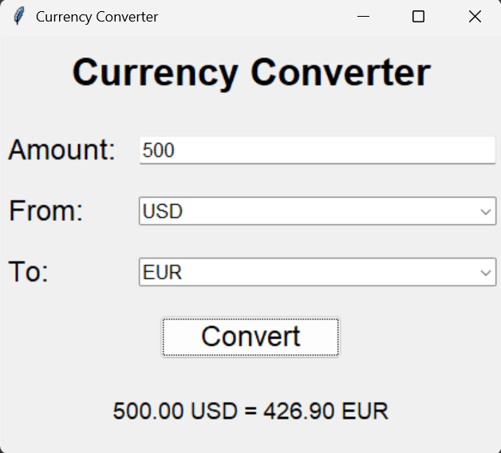

# Currency Converter

A sleek and functional desktop currency converter application built with Python and Tkinter. This tool fetches real-time exchange rates from a public API and provides a simple GUI for quick conversions.

## Features

- **Real-Time Exchange Rates:** Utilizes the [Open Exchange Rates API](https://open.er-api.com) to get the latest currency data.
- **User-Friendly GUI:** Built with `tkinter` and `ttk` for a clean, modern interface.
- **Error Handling:** Robust handling of network errors and invalid user input with helpful pop-up messages.
- **Modular Design:** Code is separated into logical modules (`converter_core.py` for API logic, `converter_gui.py` for the interface) for better maintainability.
- **Styled Components:** Uses custom styles for labels and buttons to enhance the visual appeal.

## Screenshot



## Technologies Used

- **Python 3:** Core programming language.
- **Tkinter / ttk:** For building the graphical user interface.
- **Requests:** For making HTTP requests to the external API.
- **Open Exchange Rates API:** Provides the real-time currency data.

## Installation & Setup

1.  **Clone the repository:**
    ```bash
    git clone https://github.com/DevAhmadYarKhan/currency-converter-app-python.git
    cd currency-converter-app-python
    ```

2.  **(Optional) Create a virtual environment:**
    ```bash
    python -m venv venv
    source venv/bin/activate  # On Windows: venv\Scripts\activate
    ```

3.  **Install the required dependencies:**
    ```bash
    pip install -r requirements.txt
    ```

## Usage

1.  Run the application from the project directory:
    ```bash
    python converter_gui.py
    ```
2.  Enter the amount you wish to convert.
3.  Select the source currency (the currency you have) from the "From" dropdown.
4.  Select the target currency (the currency you want) from the "To" dropdown.
5.  Click the "Convert" button.
6.  The result will be displayed instantly below the button.

## Code Overview

The project is structured in two main modules:

- **`converter_core.py`**: This module is responsible for all communication with the external API. It contains the `get_exchange_rates()` function which fetches and returns a dictionary of current rates for a given base currency.
- **`converter_gui.py`**: This module handles the user interface. It creates the application window, manages user input, calls the core logic functions, and displays the results or any errors.

This separation of concerns makes the code more organized, easier to debug, and ready for future expansion.

## API Note

This application uses the **Open Exchange Rates API**'s free plan. Please be aware that this plan has refresh limitations (e.g., rates might update only once per hour). For more frequent updates or commercial use, you would need to subscribe to a paid plan on their website.